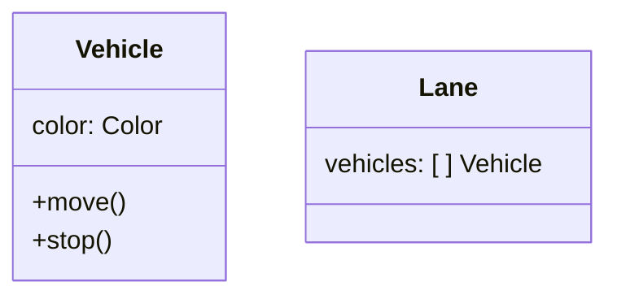

<h1 align=center >
  
  <br>
  road_intersection
</h1>

## Table of Contents
- [Overview](#overview)
- [Installation](#installation)
    - [Cloning](#cloning)
    - [Blueprint](#blueprint)
    - [SDL2 library](#sdl2-library)
        - [Description](#description)
        - [Installing](#installing)
- [Usage](#usage)
    - [Initialization](#initialization)
    - [Window](#window)
    - [Events](#events)
    - [About](#about)
- [Interface](#interface)
- [Contributors](#contributors)
- [License](#license)

## Overview

                            North
                        |  ↓  |  ↑  |
                        |  ↓  |  ↑  |
                        |     |     |
                        |     |     |
                        |     |     |
                        |     |     |
         _______________|     |     |_______________
         ← ←                                     ← ←
    East ---------------             --------------- West
         → →                                     → →
         _______________             _______________
                        |     |     |
                        |     |     |
                        |     |     |
                        |     |     |
                        |     |     |
                        |  ↓  |  ↑  |
                        |  ↓  |  ↑  |
                            South

## Installation

### Cloning

```shell
$ git clone http://learn.zone01dakar.sn/git/babacandiaye/road_intersection.git

$ cd road_intersection
```

### Blueprints

#### Classes



### SDL2 Library

Before running the program, the sdl2 library needs to be installed.

#### Description

SDL2 (Simple DirectMedia Layer) is a multimedia library that provides a simple interface for managing graphics, sound, user input, and other elements necessary for developing games and multimedia applications. It is widely used to create applications that require low-level access to display, audio, and input devices.

#### Installing

Make sure the SDL2 libraries is intalled on the system. The installation instructions may vary depending on the operating system:

- **On Ubuntu/Debian:**
  ```bash
  sudo apt-get install libsdl2-dev
  ```

- **On macOS:**
  ```bash
  brew install sdl2
  ```

To use SDL2 in a Rust project, the `sdl2` dependency needs to be added to the `Cargo.toml` file:

```toml
[dependencies]
sdl2 = "0.34" // Check for later verions
```

###### [_Table of Contents ⤴️_](#table-of-contents)

## Usage

### Initialization
Firstly, the sdl2 needs to be initialized using the **`init()`** function of the **`sdl2`** library to get a subsystem layer context.  
Then the video subsystem responsible for managing the windows and rendering is retrieved from the resulting context via the **`video()`** method.  
At this point the program has everything it needs to create windows and canvas.

### Window

A window can be initialized using the **`window()`** method on the video subsystem retrived from the subsystem context. The method takes the specified title and dimensions as arguments. To center the window on the screen, there is the **`position_centered()`** method. then the **`build()`** method is used to create the window.  
And finally, the window needs to be transformed into a canvas for graphical rendering via the **`into_canvas()`** method on the window intance.

### Events

Some events are to be handled to provide a user interaction.  
To begin with a event pump is initialized from the context using the **`event_pump()`** method. This event pump act like a pipeline transferring the user input events from the sdl context events queue to the program.  

An infinite loop si then triggered to run the program as long as the user does not close the window.  
Within the loop, the program can continuously listen to input events and handle them.  
Some of those input events can be:
- **`Event::Quit`**: Triggered when the user tries to close the window.
- **`Event::KeyDown`**: Detects if a key is pressed, and here we specifically check if the **Escape** key was pressed to exit the loop.

On each iteration the canvas is cleared via the **`clear()`** method and the display is updated with the current rendering of the canvas via the **`present()`** method in a time interval that will be set with the **`std::thread::sleep()`** function that will limit the number of frames per second to 60 using a delay.

### About

SDL2 is a powerful and flexible library that simplifies the development of multimedia applications by providing low-level abstractions for display, audio, and input. By using Rust with SDL2, you can leverage Rust's memory safety and performance while developing games or interactive applications.

For more in-depth information, refer to the [official SDL2 documentation](https://wiki.libsdl.org/) and [crates.io for sdl2](https://crates.io/crates/sdl2) for more examples and available features.

###### [_Table of Contents ⤴️_](#table-of-contents)

## Interface

To open a new window, run the program.

```rust
$ cargo run
```

###### [_Table of Contents ⤴️_](#table-of-contents)

## Contributors

[](http://learn.zone01dakar.sn/git/aliouniang)
[](http://learn.zone01dakar.sn/git/babacandiaye)
[](http://learn.zone01dakar.sn/git/emalo)
[](http://learn.zone01dakar.sn/git/jefaye)

## License

[](LICENSE)